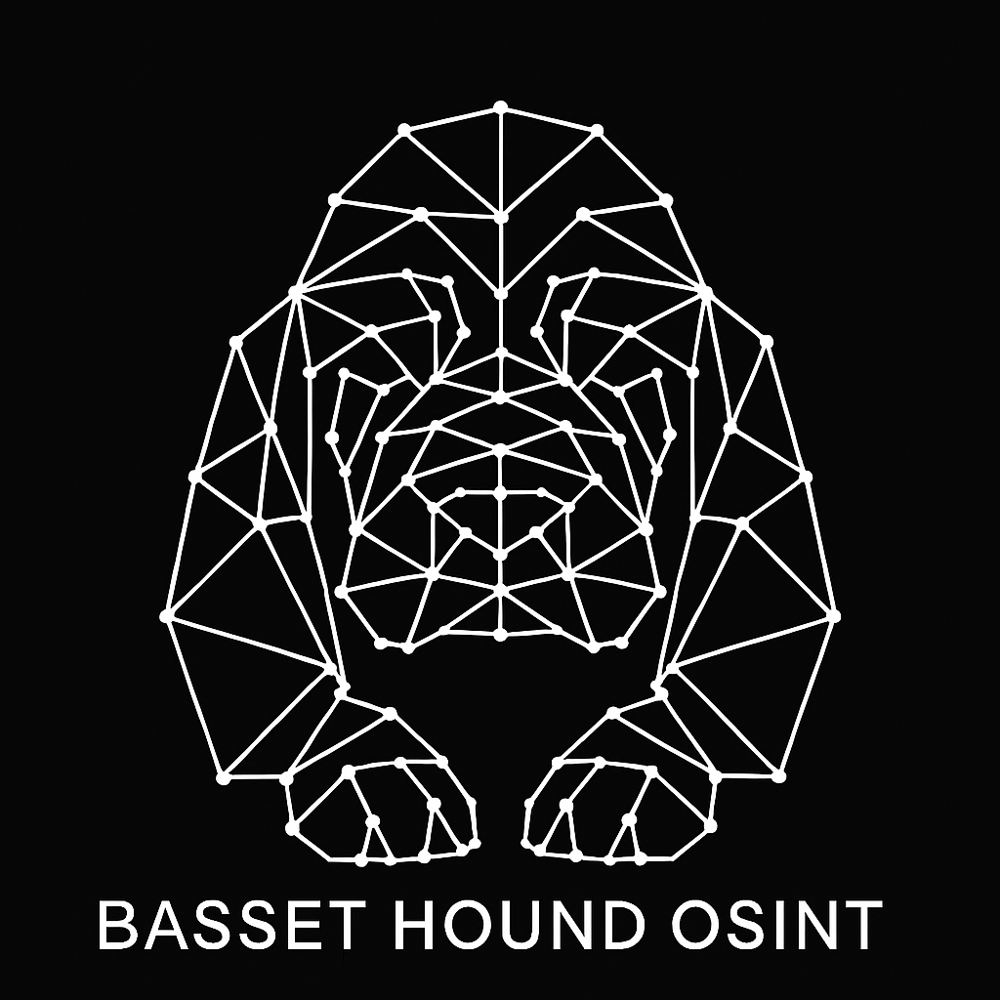

<td width="100" align="center">



</td>

# basset-hound
A BloodhoundAD-inspired tool for OSINT 

Running just Neo4j

```bash
docker compose up -d neo4j
docker compose down -v

# more agressive cleanup of non used containers not defined in the compose file
docker compose down --volumes --remove-orphans
```

Run the basset hound app
```
python3 app.py
```

Visit the app in your web browser [here](http://localhost:5000)

```
http://localhost:5000
```